# Mobile Authentication Cookie Workflow Analysis

## Overview

This document details the complete authentication cookie workflow between the Hylo mobile app and backend, identifying potential desync issues and areas for improvement.

## TLDR
- The mobile app only uses the auth cookie for web views
- The mobile app sets the auth cookie on EVERY successful graphql request. So cookie state is managed as a side-effect.
- Given that urql graph-cache request policies of 'cache-first' and 'cache-and-network' will both return stuff from the cache before making an actual urql request, these will increase the risk of desyncs (even if they are brief between a cache hit and the network request returning). Even brief desyncs can result in pages loading based on cached data, and webviews loading before a valid cookie is set in the local storage.

## Current Architecture

### Mobile App Components

#### 1. Authentication Context (`packages/contexts/AuthContext.js`)
- **Purpose**: Manages authentication state using Zustand store and URQL queries
- **Key Functions**:
  - `login()`: Executes login mutation and refreshes auth state
  - `logout()`: Executes logout mutation and refreshes auth state
  - `checkAuth()`: Queries current user status via `meCheckAuthQuery`
- **State Management**:
  - `isAuthenticated`: Based on presence of `currentUser`
  - `isAuthorized`: Requires `emailValidated`, `hasRegistered`, and no `signupInProgress`

#### 2. Session Management (`apps/mobile/src/util/session.js`)
- **Cookie Storage**: Uses AsyncStorage with key `hylo_session_cookie`
- **Functions**:
  - `setSessionCookie(resp)`: Extracts and stores cookies from response headers
  - `getSessionCookie()`: Retrieves stored cookie string
  - `clearSessionCookie()`: Removes stored cookies
- **Cookie Parsing**: Handles complex Sails.js + Heroku cookie formats

#### 3. URQL Client (`packages/urql/makeUrqlClient.js`)
- **Custom Fetch**: Intercepts responses to extract `set-cookie` headers
- **Cookie Handling**: Only **receives** cookies, does **NOT send** them
- **Cookie Updates**: Calls `setSessionCookie(response)` on every response with `set-cookie` header
- **Debug Logging**: Logs cookie updates in development: `'!!! setting cookie in urql fetch'`

#### 4. URQL Subscriptions (`apps/mobile/src/urql/mobileSubscriptionExchange.js`)
- **Purpose**: Server-Sent Events (SSE) for real-time GraphQL subscriptions
- **Authentication**: Uses `withCredentials: true` and `credentials: 'include'`
- **Cookie Handling**: **Does NOT** process `set-cookie` headers from SSE responses
- **Cookie Gap**: SSE responses bypass the custom fetch function, so cookies are never updated from subscription responses

#### 5. WebView Cookie Handling (`apps/mobile/src/components/HyloWebView/HyloWebView.js`) ✅
- **Purpose**: Displays Hylo web app within mobile app
- **Cookie Management**:
  - **Line 11**: `import { getSessionCookie, clearSessionCookie }`
  - **Line 122**: `const [cookie, setCookie] = useState()`
  - **Line 177**: `const newCookie = await getSessionCookie()`
  - **Line 344**: `headers: { cookie }` - **Correctly sends Cookie header**
- **Key Features**:
  - Retrieves cookies on focus with `useFocusEffect`
  - Shows session recovery UI when cookies are missing
  - Uses `sharedCookiesEnabled` for WebView

### Backend Components

#### 1. Session Configuration (`apps/backend/config/session.js`)
- **Session Store**: Redis-based with `@sailshq/connect-redis`
- **Cookie Settings**:
  - Name: `process.env.COOKIE_NAME`
  - Domain: `process.env.COOKIE_DOMAIN`
  - MaxAge: 60 days
  - Secure: Based on HTTPS protocol
  - SameSite: 'None' for HTTPS, 'Lax' for HTTP

#### 2. Authentication Policies
- **`sessionAuth.js`**: Checks `req.session.userId` for authentication
- **`checkJWT.js`**: Handles JWT-based authentication and creates sessions
- **Session Creation**: `UserSession.login()` sets `req.session.userId`

#### 3. GraphQL Endpoint
- **Path**: `/noo/graphql`
- **Authentication**: Relies on session cookies for user identification
- **Policies**: Uses `sessionAuth` for protected operations

## Cookie Workflow Analysis

### 1. Login Process

```mermaid
sequenceDiagram
    participant Mobile as Mobile App
    participant URQL as URQL Client
    participant Backend as Backend API
    participant Redis as Redis Session Store

    Mobile->>URQL: executeLogin(email, password)
    URQL->>Backend: POST /noo/graphql (loginMutation)
    Note over URQL,Backend: ⚠️ NO Cookie header sent
    Backend->>Backend: User.authenticate()
    Backend->>Redis: Create session with userId
    Backend->>Backend: UserSession.login(req, user)
    Backend-->>URQL: Response + Set-Cookie header
    URQL->>URQL: setSessionCookie(response)
    URQL->>Mobile: Store cookie in AsyncStorage
    Mobile->>URQL: checkAuth() to refresh state
    URQL->>Backend: POST /noo/graphql (meCheckAuthQuery)
    Note over URQL,Backend: ⚠️ Still NO Cookie header sent
    Backend-->>URQL: Unauthenticated response
    URQL-->>Mobile: No currentUser returned
```



### 2. Subsequent GraphQL Requests

```mermaid
sequenceDiagram
    participant Mobile as Mobile App
    participant URQL as URQL Client
    participant Backend as Backend API

    Mobile->>URQL: Any GraphQL query/mutation
    URQL->>Backend: POST /noo/graphql
    Note over URQL,Backend: ⚠️ NO Cookie header included
    Backend->>Backend: sessionAuth policy check
    Backend->>Backend: req.session.userId is undefined
    Backend-->>URQL: 401 Unauthorized
    URQL-->>Mobile: Authentication error
```



### 3. WebView Cookie Handling

```mermaid
sequenceDiagram
    participant Mobile as Mobile App
    participant WebView as HyloWebView
    participant WebApp as Web Application
    participant Backend as Backend API

    Mobile->>Mobile: getSessionCookie() (line 177)
    Mobile->>Mobile: setCookie(newCookie) (line 178)
    Mobile->>WebView: source={{ uri, headers: { cookie } }} (line 344)
    WebView->>WebApp: HTTP request + Cookie header
    WebApp->>Backend: Authenticated requests with cookies
    Backend-->>WebApp: Successful responses
    Note over Mobile,Backend: ✅ WebView correctly sends cookies via headers
```



## Key Discovery: Hybrid Authentication Architecture

The mobile app uses **different authentication methods** for different purposes:

| Component | Authentication Method | Cookie Handling |
|-----------|----------------------|-----------------|--------|
| **HyloWebView** | Cookies via `headers: { cookie }` | ✅ `getSessionCookie()` → Manual management |
| **URQL GraphQL** | Server-side sessions | ✅ Receives cookies, doesn't need to send |
| **fetchJSON** | Server-side sessions | ✅ Receives cookies, doesn't need to send |

**WebView Cookie Pattern:**
```javascript
// From HyloWebView.js:177-178, 344
const newCookie = await getSessionCookie()
setCookie(newCookie)
// ...
source={{ uri, headers: { cookie } }}
```

**GraphQL Session Pattern:**
```javascript
// URQL uses server-side sessions automatically
// Backend maintains req.session.userId across requests
// No explicit cookie management needed in client
```

## Critical Issues Identified

### 1. **Cookie Synchronization Gaps** 🚨
- **Problem**: No validation of stored cookies against server session state
- **Impact**: WebView may use stale/invalid cookies while GraphQL sessions remain valid
- **Root Cause**: No mechanism to verify cookie validity before WebView load

### 2. **Cookie Update on Every Successful Response** 📝
- **Behavior**: `setSessionCookie()` is called on every successful response
- **Impact**: Potential performance overhead and unnecessary AsyncStorage writes
- **Location**: Both `fetchJSON.js:28` and `makeUrqlClient.js:65`

### 3. **Cookie Synchronization Gaps** 🔄
- **Problem**: No validation of stored cookies against server session state
- **Impact**: WebView may use stale/invalid cookies while GraphQL sessions remain valid
- **Root Cause**: No mechanism to verify cookie validity before WebView load

### 4. **URQL Subscription Cookie Gap** ⚠️
- **Problem**: SSE subscriptions don't update cookies despite server sending them
- **Impact**: Cookies may become stale if only subscription responses contain updated session data
- **Root Cause**: `mobileSubscriptionExchange.js` bypasses the custom fetch function that handles `setSessionCookie()`
- **Technical Details**: SSE responses use `react-native-sse` library directly, not the URQL custom fetch

## Conclusion

The mobile app uses a **hybrid authentication system**, since the web view needs a cookie to auth.

## **Hybrid Authentication Architecture** 🔄

### **1. Session Cookies (for WebViews only)**
- **Purpose**: Authenticate WebView requests to the web application
- **Usage**: `HyloWebView` explicitly sets `headers: { cookie }`
- **Storage**: AsyncStorage via `getSessionCookie()` / `setSessionCookie()`
- **Scope**: Only needed for embedded web content

### **2. Server-Side Sessions (for GraphQL)**
- **Purpose**: Authenticate native GraphQL requests
- **Mechanism**: Backend session storage with `req.session.userId`
- **Creation**: All login methods call `UserSession.login(req, user, providerKey)`
- **Persistence**: Server-side session store (Redis)

## **Authentication Flow Analysis** 📋

### **Login Process:**
1. **Social Login**: `fetchJSON` → `/noo/login/google-token/oauth` → Creates server session + sets cookies
2. **Regular Login**: URQL → `loginMutation` → Creates server session + sets cookies  
3. **Session Verification**: URQL → `meCheckAuthQuery` → Uses server session (not cookies)

### **Key Insight:**
- **GraphQL requests are authenticated via server-side sessions**, not cookies
- **Cookies are only needed for WebView authentication**
- **Both mechanisms are established during login** but serve different purposes

## **Why This Works** ✅

1. **Server Session Persistence**: The backend maintains `req.session.userId` across requests
2. **Automatic Session Handling**: Express/Sails session middleware handles this transparently
3. **Dual Authentication**: Cookies for web content, sessions for native GraphQL

## **Potential Desync Scenarios** ⚠️

### **🚨 HIGH RISK Scenarios (Most Likely Causes):**

#### **1. App Crash/Storage Loss** 
- **Risk Level**: 🔴 **VERY HIGH**
- **Cause**: App crashes, OS memory pressure, AsyncStorage corruption, app updates
- **What Happens**: 
  - Server session remains active (Redis intact)
  - Mobile AsyncStorage gets cleared/corrupted
  - User stays authenticated for GraphQL
  - WebView has no cookie → shows "Session Required"
- **Real-World Triggers**: iOS/Android memory management, force-quit apps, OS updates
- **Frequency**: Very common in mobile environments

#### **2. Multi-Device Login/Logout Cycles**
- **Risk Level**: 🔴 **VERY HIGH** (TOM COMMENT: I'm not convinced this is HIGH risk but it could be... I assume that if the web app has forced the cookie to update that this cookie will get pushed most of the time to the mobile app before it loads a webview anyway)
- **Scenario Timeline**:
  1. User logs into mobile app → stores cookie `sess:userId:abc123`
  2. Weeks pass, mobile app unused
  3. User logs into web app → creates new session `sess:userId:xyz789`
  4. User logs out/in again on web → creates another session `sess:userId:def456`
  5. Mobile app opens → tries to use old cookie `sess:userId:abc123` (invalid)
- **Backend Behavior**: Each login generates new UUID session ID (`genid` function)
- **Cookie Invalidation**: Old sessions don't get cleaned up immediately but become stale
- **Result**: Mobile cookie points to non-existent/expired session
- **Frequency**: Possible for users who switch between devices

### **🟡 MEDIUM RISK Scenarios:**

#### **3. Cookie Synchronization Gaps**
- **Risk Level**: 🟡 **MEDIUM**
- **Cause**: Race conditions between cookie updates and WebView loads
- **Impact**: Temporary desync until next GraphQL request refreshes cookie
- **Frequency**: Occasional, usually self-healing

### **🟢 LOW RISK Scenarios (Unlikely Causes):**

#### **4. TTL Mismatches**
- **Risk Level**: 🟢 **LOW**
- **Cookie TTL**: 60 days (session.js:44)
- **Session TTL**: 60 days (session.js:67)
- **Analysis**: TTLs are synchronized, so natural expiry affects both equally
- **Frequency**: Rare, only after 60 days of inactivity

#### **5. Infrastructure Issues**
- **Risk Level**: 🟢 **LOW**
- **Examples**: Redis connectivity, server crashes, network partitions
- **Impact**: Would break both GraphQL and WebView authentication completely
- **Analysis**: Not selective desync, would cause total auth failure
- **Frequency**: Rare, monitored infrastructure

## **Cookie Refresh Mechanism** 🔄

The backend **automatically refreshes cookies on every response**:

### **Backend Behavior:**
- **Session Configuration**: 60-day TTL with Redis storage (`session.js:44,67`)
- **Automatic Refresh**: Sails/Express session middleware sends `Set-Cookie` on every response
- **Purpose**: Extends session lifetime with each user interaction (rolling expiration)

### **Mobile App Response:**
- **`fetchJSON.js:28`**: `await setSessionCookie(response)` on every 200 response
- **`makeUrqlClient.js:65`**: `await setSessionCookie(response)` on every GraphQL response with cookies
- **Result**: AsyncStorage cookie is constantly updated with fresh expiration

### **Why This Happens:**
1. **Rolling Sessions**: Backend extends session TTL on each request
2. **Cookie Synchronization**: Mobile app keeps local cookie in sync with server
3. **WebView Consistency**: Ensures WebView always has valid, non-expired cookies

### **URQL Subscriptions & Cookie Updates:**
- **Subscription Method**: Server-Sent Events (SSE) via `react-native-sse`
- **Connection**: `withCredentials: true, credentials: 'include'` (lines 34-35)
- **Cookie Updates**: **No** - SSE responses don'tuse `setSessionCookie()`
- **Authentication**: Uses server-side session, not cookies
- **Impact**: Subscriptions work independently of cookie state

### **Performance Impact:**
- **AsyncStorage Writes**: Frequent writes on every successful GraphQL query/mutation (not subscriptions)
- **Cookie Parsing**: Constant parsing/serialization of cookie strings
- **Potential Optimization**: Could check if cookie actually changed before updating

## **Cookie Synchronization & Fallback Mechanisms** 🔄

### **Current HyloWebView Behavior:**

#### **Cookie Retrieval:**
- **On Focus**: `useFocusEffect` calls `getSessionCookie()` to refresh cookie (lines 173-186)
- **State Management**: `const [cookie, setCookie] = useState()` tracks cookie availability
- **Loading Check**: Only proceeds if `cookie` exists (line 252)

#### **Fallback for Missing/Invalid Cookies:**
1. **Detection**: `if (!cookie && !isLoading)` triggers after 2-second delay (lines 158-170)
2. **Session Recovery UI**: Shows "🔐 Session Required" message (lines 253-286)
3. **Recovery Action**: "Log Out & Log Back In" button that:
   - Calls `clearSessionCookie()` (line 270)
   - Calls `logout()` to clear auth state (line 271)
   - Navigates to login as fallback (line 275)

#### **Limitations of Current System:**
- ❌ **No automatic re-sync**: If cookie is invalid/expired, no attempt to refresh from server
- ❌ **No validation**: Doesn't check if stored cookie matches server session
- ❌ **Manual recovery only**: Requires user action to resolve cookie issues
- ❌ **Broken cleanup**: `clearSessionCookie()` is incomplete

#### **Potential Improvements:**
1. **Cookie Validation Endpoint**: Backend endpoint to validate cookie without side effects
2. **WebView Error Handling**: Detect 401/403 responses and trigger re-authentication
3. **Automatic Cookie Refresh**: Trigger new GraphQL request to refresh cookie when invalid
4. **Bidirectional Communication**: Web app signals auth status back to mobile via `postMessage`
