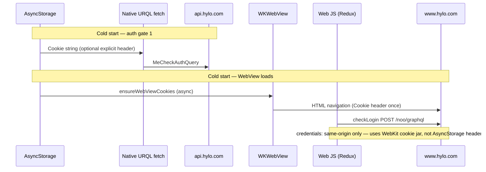
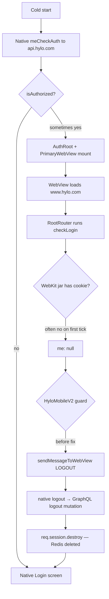

# Mobile iOS session loss on cold start — investigation notes

This document explains why users on the Hylo **iOS mobile app** (TestFlight / production) were forced to log in again after every cold start, even though the session cookie appeared valid in Proxyman and existed in **Redis** immediately after login.

It complements the older [mobile-auth-cookie-workflow.md](./mobile-auth-cookie-workflow.md), which describes cookie plumbing in general. This doc focuses on the **regression**, **root cause**, and **fixes**.

---

## Summary

| Finding | Detail |
|--------|--------|
| **Not primarily** | Backend returning `me: null` for a valid `req.session.userId` on the same request |
| **Not primarily** | AsyncStorage failing to persist the cookie (Proxyman showed the cookie on `api.hylo.com` after reopen) |
| **Primary cause** | The **web app inside the WebView** runs `checkLogin`, often gets `me: null` on the first request (cookie jar timing), then tells **native to `logout()`**, which **destroys the Redis session** |
| **Why it felt recent** | Web changes in **Mar–May 2026** (mobile WebView logout bridge + aggressive `checkLogin` logout) turned a timing flake into **session deletion** |
| **Best fix without App Store** | **Deploy web** — the WebView loads JS from `HYLO_WEB_BASE_URL` (e.g. `www.hylo.com`) |
| **Defense in depth** | Mobile changes in `HyloWebView` / `PrimaryWebView` (avoid server logout on false negatives) |

---

## Symptoms

- User logs in successfully; **Redis session exists**.
- User force-quits the app and reopens.
- **Three loading spinners**, then the **native Login** screen (email/password / social).
- **Redis session key is gone** (not just “ignored” — destroyed).
- In Proxyman on reopen: requests to **`api.hylo.com`** may still include the same `hylo.sid.1` cookie, but GraphQL returns **`me: null`** until logout runs and the session disappears.

---

## Architecture: two HTTP clients in one app

The mobile app is a **hybrid**: native React Native + embedded **WebView** running the full web app (`HyloMobileV2`).



### Native GraphQL (`api.hylo.com`)

- **Client:** URQL in `packages/urql/makeUrqlClient.js`, used from `apps/mobile/index.js`.
- **Auth check:** `AuthProvider` → `meCheckAuthQuery` with `requestPolicy: 'network-only'` (`packages/contexts/AuthContext.js`).
- **Routing:** `RootNavigator` shows authenticated vs `NonAuthRootNavigator` based on `isAuthorized`.
- **Cookie source:** `apps/mobile/src/util/session.js` — `setSessionCookie` / `getSessionCookie` (AsyncStorage key `hylo_session_cookie` or `SESSION_COOKIE_KEY`).
- **Optional:** Custom fetch can attach `Cookie` from AsyncStorage on every native request (see `fetchWithPersistedSessionCookie` in `makeUrqlClient.js` if present on your branch).

### Web app inside WebView (`www.hylo.com`)

- **Client:** Redux → `graphqlMiddleware` → `apiMiddleware` → `fetchJSON` (`apps/web/src/store/middleware/apiMiddleware.js`).
- **Auth check:** `RootRouter` dispatches `checkLogin` on mount (`apps/web/src/routes/RootRouter/RootRouter.js`).
- **Host:** In the browser, `getHost()` returns **`window.location.origin`** (e.g. `https://www.hylo.com`), **not** `api.hylo.com`.
- **Cookie on GraphQL:** In the WebView, `req` is undefined, so `Cookie: options.cookie` is **never set**. Only:

  ```js
  credentials: 'same-origin'
  ```

  So `checkLogin` depends entirely on the **WebView / WebKit cookie jar**.

### HyloWebView cookie setup (`apps/mobile/src/components/HyloWebView/HyloWebView.js`)

| Mechanism | What it does | Applies to later `fetch()` from web JS? |
|-----------|----------------|----------------------------------------|
| `getSessionCookie()` | Reads AsyncStorage | **No** (native + first load header only) |
| `source={{ headers: { cookie } }}` | Cookie on **first HTML request** | **No** — not automatic for XHR/fetch |
| `ensureWebViewCookies()` | Writes cookies into WebKit jar via `CookieManager` | **Yes**, if it finishes **before** `checkLogin` runs |
| `sharedCookiesEnabled` (iOS) | Sync WK ↔ NSURLSession over time | **Not guaranteed** on first JS tick |

The codebase already documents a **race** (comment in `HyloWebView.js`): the WebView can mount and run `checkLogin` before the jar is populated.

---

## What Proxyman proved

### After login

- `Set-Cookie` / `hylo.sid.1` on `api.hylo.com`.
- Redis session present (e.g. `sess:anon:<uuid>` — `anon` prefix is normal; see below).
- User appears logged in.

### After force-quit and reopen

- **Same** `hylo.sid.1` may appear on **`api.hylo.com`** GraphQL requests.
- Response can still be **`me: null`** (no `req.session.userId` on that request **or** a different request path without cookie).
- Then **`logout` GraphQL mutation** or **`DELETE /noo/session`** → **Redis key deleted**.
- User lands on native Login; cookie gone from client and server.

**Important:** Filter **both** hosts in Proxyman:

| Request | Typical client | Cookie source |
|---------|----------------|---------------|
| `POST https://api.hylo.com/noo/graphql` | Native URQL | AsyncStorage / explicit header / system store |
| `POST https://www.hylo.com/noo/graphql` | Web `checkLogin` | WebKit jar only (`credentials: 'same-origin'`) |

Seeing a cookie on `api.hylo.com` does **not** prove `www.hylo.com` `checkLogin` sent it.

---

## Why `me: null` does not always mean “invalid session in Redis”

The GraphQL `me` field is resolved from **`req.session.userId`** in the backend context (`apps/backend/api/graphql/index.js`). `me: null` on a given HTTP request usually means:

> **This request did not present a session the server could load** (no cookie, wrong cookie, or empty Redis row for that sid).

It does **not** automatically mean Redis was empty for a **different** concurrent request that **did** send the cookie.

### Session cookie shape (`anon` in the value)

Backend `genid` (`apps/backend/config/session.js`):

```js
return (req.userId || 'anon') + ':' + uuidv4()
```

So a cookie like `s:anon:edd4cf1d-...` is an **anonymous session id** until login sets `req.session.userId`. Regenerate-on-login is **disabled** in production (`apps/backend/api/services/UserSession.js` — “not working on production”), so the sid string can stay `anon:...` while Redis holds `userId` after login.

---

## The failure cascade (why Redis disappears)



### Native paths that call **server** logout

| Location | Trigger |
|----------|---------|
| `PrimaryWebView` | `WebViewMessageTypes.LOGOUT` from web |
| `PrimaryWebView` | `userError` on first `useCurrentUser` (should be gated) |
| `HyloWebView` | Missing cookie for ~2s → `logout()` (**fixed** to retry cookie, not logout) |
| `useLogout` | `logout()` mutation + `clearSessionCookie()` |

Web explicit logout (user menu) still sends `LOGOUT` from `GlobalNav` / `ContextMenu` — that should remain.

### Web `RootRouter` guard (Mar 2026)

Added in commit `431718e17` (“Mobile webview logout fix”):

```js
if (!isAuthorized && window.HyloMobileV2) {
  sendMessageToWebView(WebViewMessageTypes.LOGOUT)
  return null
}
```

Intent: never show the web login page inside mobile. Side effect: any time web Redux thinks the user is **not** `getAuthorized` after `checkLogin`, native **destroys** the server session.

`getAuthorized` requires signup-complete state (`apps/web/src/store/selectors/getAuthState.js`), not merely `me` existing.

---

## Timeline of relevant changes (2026)

| Date | Commit | Change | Impact |
|------|--------|--------|--------|
| **2026-03-12** | `431718e17` | “Mobile webview logout fix” — `sendMessageToWebView(LOGOUT)` when `!isAuthorized && HyloMobileV2` | False `checkLogin` → native logout → Redis wiped |
| **2026-03-12** | `527cf4736` / revert `5a321475b` | Stale-session handling experiments | Related context |
| **2026-04-17** | `ac813079a` | On `checkLogin`, `if (!me) dispatch(logout())` | **`DELETE /noo/session`** on every failed check |
| **2026-04-21** | `10443522a` | Merge PR #1334 session-cookie-issues | Above shipped |
| **2026-04-17** | `4a610211e` | Skeleton / loading changes during `checkLogin` | More visible spinners |
| **2026-05-13** | `c842c257f` | Mobile app version passthrough (web UI) | Unrelated to auth logic |
| **2026-05-20** | `a24b93892` | Commented out `dispatch(logout())` on failed `checkLogin` | Stops web **DELETE** session; **does not** remove `sendMessageToWebView(LOGOUT)` |
| **2026-04-08** | `5beee6583` | Mobile `AuthContext` → `network-only` for `meCheckAuth` | Always hits network on cold start (no stale cache cover) |

The May 20 comment in `RootRouter.js` is explicit:

> `XXXX: This breaks logging in production only. Why???`

That refers to **`checkLogin` returning `me: null` in production even when the session is valid** — consistent with WebView cookie timing, not necessarily a backend bug.

---

## Three spinners on reopen

Typical stack while the app is briefly in the “authenticated” native tree:

1. **`RootNavigator`** — waiting for first `meCheckAuth` (`fetching`, initial `null` return).
2. **`AuthRootNavigator`** — `useCurrentUser` with `network-only`, or `LoadingScreen` while `!currentUser`.
3. **`PrimaryWebView`** — spinner until `currentUser` + WebView `onLoadEnd`.

Then web `checkLogin` fails → `LOGOUT` → native login. Users perceive “three spinners then kicked out.”

---

## Is this a browser / WebKit cookie policy change?

**Partially in the ecosystem sense, not “Safari updated and broke Hylo” as the main story.**

| Factor | Role |
|--------|------|
| **Two HTTP stacks** | Native vs WKWebView — dominant cause of “cookie on api but not on www” |
| **Race on cold start** | `checkLogin` runs in `useEffect` as soon as React mounts; jar may be empty |
| **`SameSite=None` + `Secure`** | Used on HTTPS (`apps/backend/config/session.js`); correct for cross-subdomain, but jar must be populated |
| **iOS `sharedCookiesEnabled`** | Helps over time; does not guarantee cookies before first web GraphQL |
| **Apple WebKit tightening** | Can affect cross-site cookies; less relevant for same-origin `POST www.hylo.com/noo/graphql` **once the jar has the cookie** |
| **Recent Hylo web behavior** | Turns timing flake into **session destruction** — matches “started a few weeks ago” |

---

## Fixes

### 0. Sync WebView cookie jar before first web GraphQL (recommended)

**Native (`apps/mobile/src/util/session.js`):**

- `prepareWebViewCookies()` — writes AsyncStorage cookies into the WebKit jar via `CookieManager.set`, then **reads them back** with `CookieManager.get` until they match (retries with backoff).
- `HyloWebView` does **not** mount the WebView until `prepareWebViewCookies()` completes.
- `injectedJavaScriptBeforeContentLoaded` sets `window.HyloNativeCookiesReady=true` when verification succeeded.

**Web (`apps/web/src/util/webView.js` + `RootRouter.js`):**

- `waitForNativeSessionCookies()` — on `HyloMobileV2`, `checkLogin` waits (poll up to ~5s) for `HyloNativeCookiesReady` before the first GraphQL request.

Together, the first `POST www.hylo.com/noo/graphql` from `checkLogin` should run with the same session cookies native already uses on `api.hylo.com`.

Requires **mobile deploy** for native gating + **web deploy** for `waitForNativeSessionCookies` (web-only part still helps if native flag is injected).

### Web-only `RootRouter` guard caveat

The first version of `hadAuthorizedWebSession` returned `<Loading />` forever when `checkLogin` never succeeded (cookie jar still empty). That looked like infinite loading inside the WebView while native still thought the user was authorized.

**Updated web behavior:**

- `checkLoginWithMobileRetries()` — several `checkLogin` attempts with delay on `HyloMobileV2`
- `waitForNativeSessionCookies()` — short wait (~400ms) when `HyloNativeCookiesReady` is undefined (older mobile builds)
- If still `!isAuthorized` on cold start: **`return null`** (no `LOGOUT`, no infinite spinner); optional background `checkLogin` polls
- Mid-session loss of auth: still `LOGOUT` when `hadAuthorizedWebSession` was true

### 1. Web deploy (no App Store required)

The WebView loads the **live web bundle** from `HYLO_WEB_BASE_URL`. Shipping web to production updates behavior for existing app installs.

**Implemented in `RootRouter.js`:**

- `hadAuthorizedWebSession` ref — only `sendMessageToWebView(LOGOUT)` if web **previously** had an authorized session in this page load (real expiry), not on first cold `checkLogin` failure.
- On cold start `!isAuthorized` + `HyloMobileV2`: show `<Loading />` instead of native logout.

**Optional follow-ups (web-only):**

- Retry `checkLogin` once or twice when `window.HyloMobileV2` (delay ~300–500ms).
- Do **not** re-enable `if (!me) dispatch(logout())` on initial load (Apr 2026 behavior).

### 2. Mobile deploy (recommended defense in depth)

| File | Change |
|------|--------|
| `PrimaryWebView.js` | Ignore web `LOGOUT` while native `isAuthorized` is still true; don’t server-logout on transient `userError` |
| `HyloWebView.js` | On missing cookie, **retry** `getSessionCookie` / `ensureWebViewCookies` — do **not** call `logout()` (destroys Redis) |
| `makeUrqlClient.js` | Attach `Cookie` from `getSessionCookie()` on native GraphQL requests (helps native path; does not fix web `checkLogin`) |

### 3. Backend (optional observability)

Usually **not** required to fix the loop. Short-lived logging on GraphQL context helps prove diagnosis:

- `!!req.session.userId`
- operation name (`MeCheckAuthQuery`, `CheckLogin`, `logout`)
- do **not** log raw cookie values

---

## Debugging checklist (production / TestFlight)

1. **Confirm which login UI** — native Login vs web login inside WebView vs flash-then-login.
2. **Proxyman — filter both hosts** on one cold start:
   - `api.hylo.com` — native `MeCheckAuthQuery`
   - `www.hylo.com` — web `CheckLogin` query
3. **Compare request `Cookie` headers** byte-for-byte on first vs second GraphQL after reopen.
4. **Watch for destructive calls** during spinners:
   - GraphQL `logout` mutation
   - `DELETE /noo/session`
5. **Redis** — confirm key exists after login; confirm it disappears **after** logout request, not before.
6. **Verify web deploy version** — mobile shell version ≠ web bundle version.

Enable web `debugCheckLogin` in config when available to see `[Hylo checkLogin]` timing in the WebView console (Safari Web Inspector → attached device).

---

## Key files reference

| Area | Path |
|------|------|
| Web cold-start auth | `apps/web/src/routes/RootRouter/RootRouter.js` |
| Web `checkLogin` | `apps/web/src/store/actions/checkLogin.js` |
| Web fetch / host | `apps/web/src/store/middleware/apiMiddleware.js` |
| Web authorized selector | `apps/web/src/store/selectors/getAuthState.js` |
| Web → native message | `apps/web/src/util/webView.js`, `packages/shared/src/constants.js` |
| Native auth | `packages/contexts/AuthContext.js` |
| Native routing | `apps/mobile/src/navigation/RootNavigator/RootNavigator.js` |
| WebView shell | `apps/mobile/src/screens/PrimaryWebView/PrimaryWebView.js` |
| Cookie storage | `apps/mobile/src/util/session.js` |
| WebView cookies | `apps/mobile/src/components/HyloWebView/HyloWebView.js` |
| Native logout | `apps/mobile/src/hooks/useLogout.js` |
| Session config | `apps/backend/config/session.js` |
| Login / session | `apps/backend/api/services/UserSession.js` |
| GraphQL context | `apps/backend/api/graphql/index.js` |
| Older cookie doc | [mobile-auth-cookie-workflow.md](./mobile-auth-cookie-workflow.md) |

---

## Test plan after web deploy

1. Log in on TestFlight; confirm Redis session exists.
2. Force-quit; reopen.
3. **Must not** see `logout` mutation or `DELETE /noo/session` during loading.
4. Redis session **still exists** if login fails UI-wise.
5. User stays logged in (or at worst sees loading longer — not kicked to Login with destroyed session).
6. Explicit logout from app menu still clears session and returns to Login.

---

## Open questions / follow-up

- [ ] Confirm in Proxyman that first `www.hylo.com/noo/graphql` `CheckLogin` lacks `Cookie` while `api.hylo.com` has it on the same reopen.
- [ ] Consider awaiting `ensureWebViewCookies()` before rendering WebView (mobile) to remove the race entirely.
- [ ] Revisit `UserSession.login` session regenerate on production (commented out for session fixation).
- [ ] Align `docs/mobile-auth-cookie-workflow.md` with this doc (some tables there incorrectly imply native GraphQL does not need to send cookies).

---

*Last updated: investigation from mobile iOS session reports, Proxyman traces, and git history Mar–May 2026.*
