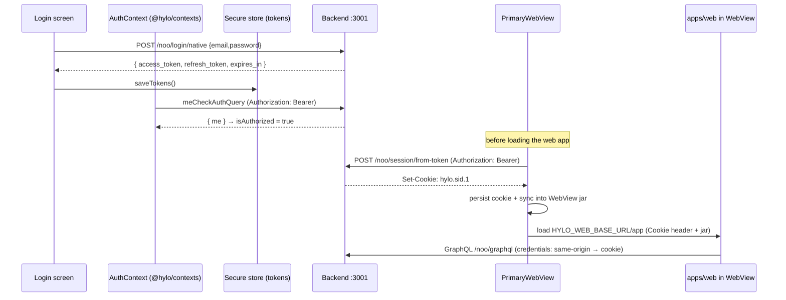

# Plan: `apps/mobile-leap` — a modern Expo rebuild of the Hylo mobile shell

**Status:** proposal / planning doc. No implementation commitment.

## TL;DR

The current `apps/mobile` app is a **thin native shell**: a non-auth navigator (Login / Signup / Forgot Password) plus a single full-screen `PrimaryWebView` that hosts the entire authenticated product (the `apps/web` React app). Everything else (the ~40 legacy native screens) is already stubbed out and points at the WebView.

Because the surface area is small, we can stand up a clean **Expo SDK 56** app (`apps/mobile-leap`) that reproduces exactly these core needs:

1. A root navigator that switches between **non-auth** and **auth** trees based on `useAuth().isAuthorized`.
2. **Login, Signup, Forgot Password** native screens.
3. **Bearer-token auth** (REST `/noo/login/native` → token pair in secure storage) reusing the shared `@hylo/*` packages.
4. A **`PrimaryWebView`** that loads `HYLO_WEB_BASE_URL` authenticated.
5. The **token → cookie bridge** that authenticates the WebView (the web app stays on cookie auth — see §7 — so the new app still needs this).
6. Supporting concerns: deep linking, push (OneSignal), Sentry, Intercom, social sign-in, theming.

The win: a current, supportable RN base (0.85 / React 19.2), EAS build pipeline, config plugins instead of hand-maintained `ios/` + `android/` folders, and no more "blockers to upgrading React Native."

---

## 1. Where we are today (baseline)

Findings from `apps/mobile` (see also the auth/cookie code referenced throughout):

| Concern | Today |
|---|---|
| Framework | **Bare React Native 0.77.3**, React 18.3.1, hand-maintained `ios/` + `android/` |
| Build/CI | CocoaPods + Gradle, Bitrise |
| Navigation | `@react-navigation/native` 7 + `@react-navigation/stack` 7 |
| Auth (native) | REST `POST /noo/login/native` → OAuth token pair, stored in **Keychain** (`react-native-keychain`) |
| Auth state | GraphQL `meCheckAuthQuery` via **urql** (`@hylo/urql` / `packages/urql`) |
| WebView | `react-native-webview` 13 (+ `react-native-autoheight-webview`) loading `HYLO_WEB_BASE_URL` |
| WebView auth | **Token → session cookie bridge** via `POST /noo/session/from-token`, mirrored into the WebView cookie jar with `@react-native-cookies/cookies` |
| Config | `react-native-config` (`API_HOST`, `HYLO_WEB_BASE_URL`, `SESSION_COOKIE_KEY`, …) |
| Styling | `nativewind` 4 + `tailwindcss` 3 |
| Shared code | `@hylo/contexts`, `@hylo/graphql`, `@hylo/hooks`, `@hylo/navigation`, `@hylo/presenters`, `@hylo/shared`, `@hylo/urql` |
| Native SDKs | OneSignal, Sentry, Intercom, Google/Apple sign-in, Mapbox, Mixpanel |

### The auth/cookie flow, in one diagram



The crucial detail driving the cookie bridge: **the web app inside the WebView authenticates its own GraphQL/REST calls with cookies** (`credentials: 'same-origin'`), not bearer tokens. This is a deliberate, permanent choice (see §7) — so the new app must keep bridging its native bearer token into a WebView session cookie. See:

```26:37:apps/web/src/util/graphql.js
// For directly querying our API outside of the Redux store.
export async function queryHyloAPI ({ query: unknownGraphql, variables }) {
  const params = { query: graphqlToString(unknownGraphql), variables }
  const response = await fetch(getHyloAPIEndpointURL(), {
    body: JSON.stringify(params),
    credentials: 'same-origin',
```

---

## 2. Target stack (`apps/mobile-leap`)

| Concern | Target | Notes |
|---|---|---|
| Framework | **Expo SDK 56** (RN 0.85, React 19.2) | Latest stable as of May 2026 |
| Build | **EAS Build + `expo-dev-client`** | Not Expo Go — we depend on custom native modules |
| Native config | **Config plugins + `app.config.ts` + prebuild** | Replaces hand-edited `ios/`/`android/` |
| Navigation | **React Navigation 7 (native stack)** — confirmed | Reuse `@hylo/navigation` linking; not switching to Expo Router |
| State | **Zustand** (only if/where needed) — confirmed | Replaces Redux; auth state lives in `@hylo/contexts` + urql already |
| Secure tokens | **`expo-secure-store`** | Replaces `react-native-keychain` |
| Key-value | `@react-native-async-storage/async-storage` | Unchanged |
| WebView | `react-native-webview` (Expo-managed version) | Drop `react-native-autoheight-webview` (full-screen, not auto-height) |
| Cookies | `@react-native-cookies/cookies` via config plugin | Needed for the WebView session bridge (web stays on cookies, §7) |
| Env/config | `expo-constants` + `app.config.ts` `extra` + EAS env | Replaces `react-native-config` |
| Styling | `nativewind` 4 + `tailwindcss` 3 | Unchanged; reuse `global.css`/theme |
| Push | `onesignal-expo-plugin` + `react-native-onesignal` | Config plugin handles the iOS NSE |
| Crash/log | `@sentry/react-native` (Expo plugin) | |
| Support chat | `@intercom/intercom-react-native` (config plugin) | |
| Social sign-in | `expo-apple-authentication` + `@react-native-google-signin/google-signin` | |
| Shared code | `@hylo/*` workspace packages | **Reused as-is** — this is the key leverage |

### Why dev client (not Expo Go)

OneSignal, Intercom, secure store, cookies, Google sign-in, and Mapbox all ship native code. Expo Go cannot load them. We use **`expo-dev-client`** + **EAS Build** so we still get the Expo workflow (config plugins, OTA-able JS, `expo prebuild`) while bundling custom native modules.

---

## 3. Proposed directory layout

```
apps/mobile-leap/
├── app.config.ts            # name, scheme, plugins, extra (env), version
├── eas.json                 # dev / preview / production build profiles
├── package.json
├── babel.config.js          # nativewind + reanimated plugins
├── metro.config.js          # monorepo symlink/workspace resolution
├── tailwind.config.js
├── global.css
├── index.ts                 # registerRootComponent(App)
├── src/
│   ├── App.tsx              # provider stack + RootNavigator
│   ├── navigation/
│   │   ├── RootNavigator.tsx
│   │   ├── NonAuthNavigator.tsx     # Login / Signup / ForgotPassword
│   │   ├── AuthNavigator.tsx        # single screen → PrimaryWebView
│   │   ├── SignupNavigator.tsx
│   │   └── linking.ts               # reuse @hylo/navigation linking config
│   ├── screens/
│   │   ├── Login/
│   │   ├── Signup/
│   │   ├── ForgotPassword/
│   │   └── PrimaryWebView/
│   ├── components/
│   │   └── HyloWebView/
│   ├── auth/
│   │   ├── authAdapter.ts           # mobileAuthAdapter for @hylo/contexts AuthProvider
│   │   ├── authApi.ts               # /noo/login/native, /noo/oauth/token, revocation
│   │   ├── tokenStore.ts            # expo-secure-store + single-flight refresh
│   │   └── session.ts               # token → cookie bridge for the WebView
│   ├── services/                    # onesignal, intercom, sentry, mixpanel init
│   ├── config/                      # typed access to expo-constants extra
│   └── urql/                        # makeUrqlClient wiring (mostly from @hylo/urql)
└── assets/
```

Most of `src/auth/` is a **near-verbatim port** of `apps/mobile/src/util/{authApi,tokenStore,session}.js`, swapping `react-native-keychain` → `expo-secure-store` and `react-native-config` → `expo-constants`.

---

## 4. Implementation phases

### Phase 0 — Scaffold & monorepo wiring (foundation)

**Runbook:** `docs/mobile-leap-phase-0-runbook.md`  
**Scaffold files:** `docs/mobile-leap-phase-0-scaffold/` (copy into `apps/mobile-leap` after `create-expo-app`)

- `create-expo-app` (SDK 56, TypeScript) into `apps/mobile-leap`.
- Add `expo-dev-client`; configure `eas.json` (dev/preview/production).
- Wire Metro + Babel for the **Yarn workspace**: `@hylo/*` package resolution, symlink support, `nativewind` and `reanimated` Babel plugins.
- Port `tailwind.config.js` + `global.css` + theme from `apps/mobile`.
- Set up `app.config.ts` with `scheme: 'hyloapp'`, bundle IDs, and `extra` env (`API_HOST`, `HYLO_WEB_BASE_URL`, `SESSION_COOKIE_KEY`, Sentry/OneSignal/etc.).
- **Milestone:** `eas build --profile development` produces an installable dev client showing a "hello" screen with NativeWind styling.

### Phase 1 — Auth core (no UI yet)
- Port `tokenStore` to `expo-secure-store` (keep the in-memory cache + **single-flight `refreshAndSaveTokens`** — this prevents the rotating-refresh-token double-spend logout bug).
- Port `authApi` (`/noo/login/native`, `/noo/oauth/token`, `/noo/oauth/token/revocation`).
- Wire `@hylo/urql` `makeUrqlClient` with the bearer `authExchange` reading `getCachedTokens()`.
- Wrap the app in `AuthProvider` (`@hylo/contexts`) with a `mobileAuthAdapter`.
- **Milestone:** a dev-only button can log in via `/noo/login/native`, store tokens, and `meCheckAuthQuery` resolves `isAuthorized`.

### Phase 2 — Navigation shell
- `RootNavigator` switching on `isAuthorized` (mirror current behavior: **do not unmount the WebView on background auth refetches**).
- `NonAuthNavigator`: Login (default) → Signup (nested) → ForgotPassword (modal).
- `AuthNavigator`: single `Main` screen rendering `PrimaryWebView`.
- Reuse `@hylo/navigation` linking config; add `expo-linking` prefixes (`hyloapp://`, `https://www.hylo.com`, staging).
- **Milestone:** logged-out → Login UI; logged-in → empty WebView placeholder; deep links route correctly.

### Phase 3 — Native auth screens
- Rebuild **Login** (email/password → `useAuth().login`), **Forgot Password**, and the **Signup** multi-step flow (intro → email validation → registration → avatar → location).
- Social sign-in: `expo-apple-authentication` + `@react-native-google-signin/google-signin`, posting to the `X-Hylo-Token-Auth: 1` endpoints → store returned token pair.
- Magic-link / token login deep-link handler (`/noo/login/jwt`, `/noo/login/token`).
- **Milestone:** full email + social signup/login works end to end on a device, landing on `isAuthorized`.

### Phase 4 — PrimaryWebView + session bridge
- Build `HyloWebView` (`react-native-webview`, `sharedCookiesEnabled`, `injectedJavaScriptBeforeContentLoaded` setting `window.HyloWebView`, `window.HyloMobileV2`, `window.HyloMobileAppVersion`).
- Port the **token → cookie bridge** (`session.ts`): `POST /noo/session/from-token`, persist cookie, mirror into the WebView jar via `@react-native-cookies/cookies`, domain-scope for staging (`.hylo.com`).
- Handle WebView→native messages (`LOGOUT`, `VERIFY_AUTH`, `THEME_CHANGE`) from `@hylo/shared` constants.
- Unified loading overlay (auth + bridge + page load) and `VERIFY_AUTH` re-mint-and-reload recovery.
- **Milestone:** authenticated web app loads with no login flash; logout via web nav tears down native session; `VERIFY_AUTH` recovers a desynced session.

### Phase 5 — Platform services & parity
- OneSignal (`onesignal-expo-plugin` — handles the iOS Notification Service Extension that's currently hand-maintained in `ios/OneSignalNotificationServiceExtension`), Sentry, Intercom, Mixpanel.
- App icon, splash (`expo-splash-screen`), status/navigation bar theming synced to `THEME_CHANGE`.
- Version check / forced-update screen.
- **Milestone:** push notifications deep-link into the right WebView route; crash reports flow to Sentry.

### Phase 6 — Hardening, store, cutover
- E2E smoke (Maestro or Detox) for login → WebView → logout.
- Staging vs production env profiles via EAS; submit via `eas submit`.
- Parallel TestFlight / internal track alongside the legacy app; migrate cohorts; deprecate `apps/mobile`.

---

## 5. Native-module migration cheatsheet

| Current (bare RN) | Expo replacement | Risk |
|---|---|---|
| `react-native-keychain` | `expo-secure-store` | Low — same get/set/clear shape |
| `react-native-config` | `expo-constants` `extra` + EAS env | Low — typed config wrapper |
| `react-native-autoheight-webview` | `react-native-webview` (full screen) | Low — we don't need auto-height for the primary view |
| `@react-native-cookies/cookies` | Same lib via config plugin (dev client) | **Medium** — verify WKWebView jar writes under SDK 56 |
| OneSignal (manual NSE) | `onesignal-expo-plugin` | Medium — plugin manages the NSE/entitlements |
| Sentry (manual) | `@sentry/react-native` Expo plugin | Low |
| Intercom (manual) | `@intercom/intercom-react-native` plugin | Low/Medium |
| Google sign-in | `@react-native-google-signin/google-signin` plugin | Low |
| Apple sign-in | `expo-apple-authentication` | Low |
| Mapbox (if still native) | `@rnmapbox/maps` plugin | Medium — likely unnecessary if maps live in the web app |

---

## 6. Key decisions (confirmed)

1. **Navigation — React Navigation 7 native stack.** Reuses `@hylo/navigation` linking and minimizes churn for a 4-screen shell. We are **not** adopting Expo Router.
2. **Cookies — keep the WebView session bridge.** The web app stays on cookie auth for security reasons (see §7), so the new app keeps the token → cookie bridge. No attempt to make the WebView cookie-free.
3. **State — drop Redux; use Zustand only where needed.** Auth state already lives in `@hylo/contexts` + urql, so most of the shell needs no global store. Reach for a small Zustand store only for genuinely shared UI/native state (e.g. theme, loading overlay). Call the social-login endpoints directly instead of via the old Redux `apiMiddleware`.
4. **TypeScript everywhere.** The shared packages are JS; the new app should be TS with light `.d.ts` shims where needed.

---

## 7. Why the WebView still uses cookies (and why that's fine)

Native auth is **bearer tokens** (secure store), but the embedded web app (`apps/web`) authenticates its own GraphQL/REST traffic with **cookies** (`credentials: 'same-origin'`). The new app bridges the two: it exchanges its access token for a session cookie at `POST /noo/session/from-token` and mirrors that cookie into the WebView's native jar.

We evaluated removing cookies — making the web app speak `Authorization: Bearer` inside the WebView — but **decided against it: keeping the web app on HttpOnly cookies is the more secure browser posture** (a JS-reachable token increases XSS blast radius), and the web app's WebSocket layer has no bearer path today. Bearer tokens belong on **native**, where secure storage is real; cookies belong on the **web/WebView**, where HttpOnly protects them. So the bridge is a deliberate, permanent part of the design, not tech debt.

### Why this needs `@react-native-cookies/cookies`

You might expect `react-native-webview`'s `sharedCookiesEnabled` + a `Cookie` request header to be enough. It isn't, for two reasons:

- **`sharedCookiesEnabled` is iOS-only.** On Android the WebView's cookie store is completely separate from the native HTTP stack, so a cookie obtained by a native `fetch` is invisible to the WebView unless we write it into the WebView's jar explicitly.
- **In-WebView XHR after first paint.** The `source.headers.cookie` only seeds the initial document request. Subsequent GraphQL/REST calls the web app makes need the cookie in the WebView's own jar. If the server doesn't re-issue `Set-Cookie` on a request (valid session, no refresh), the jar stays empty and the web app bounces to logout.

`@react-native-cookies/cookies` (`CookieManager`) is what writes the session cookie into the WebView jar (WKWebView on iOS, system CookieManager on Android) and clears it on logout. There is no first-party Expo module for this, but the library works in an EAS dev client via its config plugin. This is the one **medium-risk** native dependency to validate early under SDK 56 (see the cheatsheet in §5).
